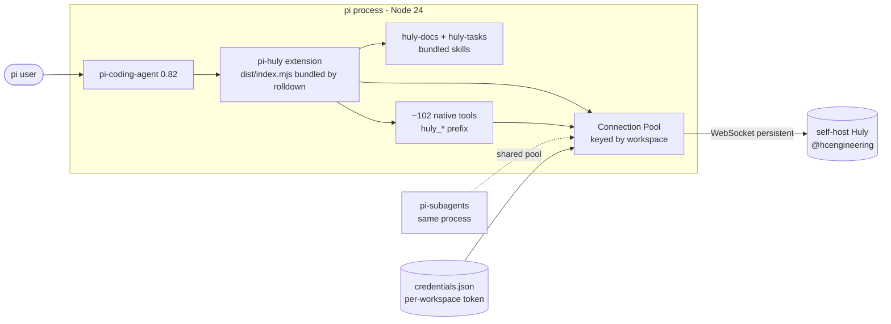
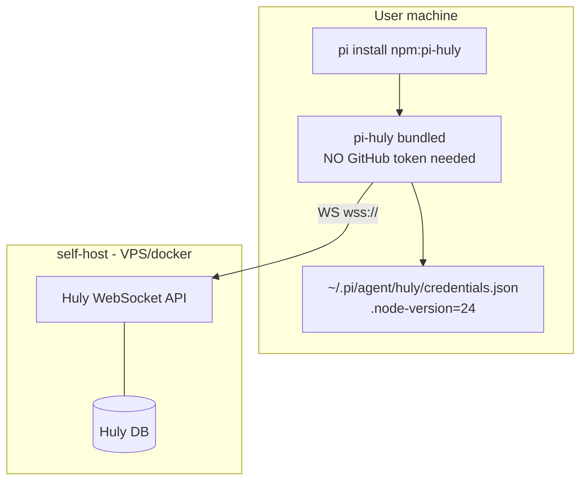

# pi-huly — Tech Stack & Architecture

> Bước 3/10. Phase HOW. Trace requirement (xem
> [02 - Requirements](./02-requirements.md)). Stack **toàn oxc-aligned + native
> TS**: nub + oxlint/oxfmt + rolldown + TypeScript 7 (Go).

## 1. Tech Stack (chốt)

| Layer | Tech | Version (verify) | Constraint/Pin | Lý do (trace FR/NFR) | ADR ref |
|---|---|---|---|---|---|
| Ngôn ngữ | TypeScript | **7.x** (native Go compiler) | `tsconfig` strict | pi extension = TS, type-safe tool params | D1 |
| Runtime | Node.js | **24 LTS** (floor `>=22.19.0` per pi engine) | `.node-version` | pi-coding-agent 0.82.1 engine | D1, NFR-05 |
| Node version mgr | nub | latest | auto-install Node 24, thay nvm/fnm | repro env | — |
| Package manager (dev) | nub | latest | pnpm-compat, `pnpm-lock.yaml`, oxc-powered | match `pi install` semantics, fast | NFR-06 |
| Script runner | nub run / `nub <file>` | — | oxc transpile TS trực tiếp, 24× nhanh `pnpm run` | dev ergonomics | NFR-07 |
| Build/bundle (prod) | rolldown | ^1.x (stable May 2026) | bundle → `dist/index.mjs` ESM; external pi-*+ node:* + ws + @hcengineering | dist chỉ code pi-huly; @hcengineering = npm dep (consumer install, no token) | D1, NFR-06 |
| Lint | oxlint | latest | oxc, fast | code quality | NFR-07 |
| Format | oxfmt | latest | oxc | code style | NFR-07 |
| Typecheck | tsc `--noEmit` | 7.x (native Go, 10× faster) | strict gate CI | type safety | NFR-07 |
| Test | vitest | ^4.1 | devDep | unit + integration, ESM-native | NFR-07 |
| Markdown lint | markdownlint-cli2 | latest | devDep | design doc lint | NFR-07 |
| Mock Huly (test) | ws-based mock server | — | devDep (test) | integration test không cần Huly thật | NFR-07 |
| CI | GitHub Actions | — | `.github/workflows/ci.yml` (fmt+lint+typecheck+test+bundle) | quality gate | NFR-07 |
| Huly client | `@hcengineering/api-client` | ^0.7.413 (npm public dep) | dep, external in bundle (rolldown external) | WebSocket connect + CRUD | D3, D10 |
| Huly domain | `@hcengineering/{platform,core,tracker,contact,document,tags,task,attachment,chunter,time,view,text-markdown}` | ^0.7.x (match api-client, npm public dep) | dep, external | class refs + markup | D4, D10 |
| Markup | `@hcengineering/text-markdown` | ^0.7.x (npm public dep) | `markdownToMarkup`/`markupToMarkdown`/`markupToJSON` | markdown round-trip (KHÔNG reimplement parser) | D10 |
| WebSocket | ws | ^8.18 (external in bundle) | dep | api-client import ws runtime | D3 |
| pi peers | `@earendil-works/{pi-coding-agent,pi-ai,pi-tui,pi-agent-core}` | ^0.82.1 | peerDependencies `*` (pi bundle core) | extension API + TUI render | D1, D12 |
| Schema | typebox | ^1.1.38 | peerDep `*` | tool parameter schema (pi dùng) | D5 |
| Publishing | npm public | — | `pi-package` keyword, `pi` manifest | `pi install npm:pi-huly` | FR-01 |

## 2. Version Verification

| Tech | Latest stable | Release | Verified via | Breaking change? |
|---|---|---|---|---|
| TypeScript | **7.x** (native Go) | 2026-07-08 | devblogs.microsoft.com | native rewrite, mostly compat |
| Node | 24 LTS | 2025-10 Active LTS | pi engine `>=22.19.0`, local 22.22.3 | floor 22.19 |
| pi-coding-agent | 0.82.1 | local | local install | target |
| @hcengineering/api-client | **0.7.413** | npm registry | npm search | 0.7.x — pin `^0.7.413` |
| @hcengineering/text-markdown | 0.7.x | npm registry | match api-client batch | — |
| ws | 8.18.x | huly-mcp dep | npm | stable |
| typebox | 1.1.38 | local pi dep | local | — |
| nub | latest | nubjs.com | web | pnpm-compat, oxc |
| oxlint | latest | oxc.rs | web | — |
| oxfmt | latest | oxc.rs | web | — |
| rolldown | **1.x** | 2026-05 (GA) | github releases | stable, oxc |
| vitest | 4.1.10 | npm | web search | v4 stable, v5 beta (skip) |

## 3. Compatibility Matrix

| Combo | Tương thích? | Verify | Note |
|---|---|---|---|
| Node 24 + pi-coding-agent 0.82.1 | ✅ | pi engine `>=22.19.0` | 24 > 22.19 |
| TS 7 + pi-coding-agent 0.82.1 types | ✅ (verify) | TS 7 backward-compat; pi .d.ts | R6 edge case test Bước 4 |
| TS 7 + typebox 1.1.38 | ✅ | TS 7 compat | type defs OK |
| rolldown + @hcengineering ESM graph | ✅ (verify) | rolldown rollup-compat; external config | `treeshake.moduleSideEffects:"no-external"` |
| rolldown + ws external | ✅ | externalize ws + node:*+ pi-* | R3 config documented |
| nub (pnpm-compat) + pnpm-lock.yaml | ✅ | nub reads/writes pnpm lockfile | consumer `pi install` (npm) tách biệt |
| nub + @hcengineering build scripts | ⚠️ (R4) | nub deny-by-default | `nub approve-builds` + `trustedDependencies` |
| @hcengineering/api-client 0.7.413 + ws 8.18 | ✅ | huly-mcp uses ws ^8.18 | api-client imports ws |
| @hcengineering/* 0.7.x cross-package | ✅ | same monorepo version batch | pin tất cả `^0.7.x` |
| oxlint/oxfmt + TS 7 | ✅ | oxc parser independent of tsc | không phụ thuộc TS version |
| vitest 4 + Node 24 | ✅ | vitest supports Node 18+ | OK |
| @hcengineering public npm dep → consumer no GitHub token | ✅ | deps resolved runtime từ node_modules, KHÔNG bundled in tarball | KEY win (NFR-06) |

**Conflict/Kiểm tra thêm:**

- `@hcengineering/*` publish **public trên npmjs.org** (verified 2026-07-27).
  Maintainer build + consumer `pi install` đều KHÔNG cần token (KHÔNG cần
  GitHub Packages registry). D10 note cũ (GitHub token install) sai — install
  trực tiếp `pnpm add @hcengineering/*` works zero-config.
- **CORRECTION (T-38 audit 2026-07-27)**: §1/§3/§4 table rows + §7 đã updated
  — @hcengineering là **npm public dependency** (package.json `dependencies`),
  KHÔNG bundle vào dist. NFR-06 (consumer no token) vẫn ĐÚNG: @hcengineering
  public trên npmjs.org, npm auto-install runtime.
  `rolldown.config.ts` `external: [/^@hcengineering\//]` → dist/index.mjs
  `import` từ node_modules runtime. NOTICE.md + README.md đã sync.
- ws optional deps (bufferutil/utf-8-validate): external hoặc skip (fallback
  pure-JS). Test R2.

## 4. Đánh giá khả năng áp dụng

| Tiêu chí | Đánh giá | Chi tiết |
|---|---|---|
| Match requirement (Bước 2) | ✅ | trace: FR-01..17, NFR-01..11 |
| Team skill / learning curve | 🟡 | @hcengineering generic CRUD + class refs — học 1 lần; markup utils có doc; nub/rolldown oxc mới nhưng doc tốt |
| Maturity + community | ✅ | pi active (0.82), Huly hcengineering production, rolldown 1.x GA, vitest mainstream, oxc active |
| License | ✅ (verify R1) | pi=MIT, @hcengineering=EPL/MPL? verify Bước 10, ws=MIT, vitest=MIT, nub/oxc=MIT |
| Effort tích hợp | **M** | bundle config + 19 domain tool impl + markup round-trip test |
| Performance | ✅ | TS 7 native + nub + rolldown + oxlint/oxfmt = fastest toolchain, full oxc |

## 5. Architecture Diagram

## 6. Deployment Diagram

## 7. Recommendation & Alternatives

**Khuyến nghị**: combo bảng §1 (toàn oxc + native TS). Lý do trace requirement:

- D1/D10 (native, reimplement thin) → api-client + text-markdown + rolldown
  bundle, KHÔNG Effect, KHÔNG vendor huly-mcp.
- D3 (WS pool) → api-client `connect` + ws + pool module.
- D5 (`huly_`) → typebox schema per tool.
- NFR-06 → **@hcengineering public npm dep → consumer no GitHub token** (KEY). Bundle external, KHÔNG inline.
- NFR-07 → vitest + oxlint/oxfmt + tsc 7 + CI; nub/rolldown oxc fast.

**Alternatives** (đã consider, loại):

- Build: esbuild (thay rolldown) — pro: proven huly-mcp dùng, con: không oxc-
  aligned (stack tách); tsc emit — con: không bundle → consumer cần GitHub
  token (FAIL NFR-06).
- Lint/format: biome — pro: single tool, con: không oxc-aligned; eslint +
  typescript-eslint — con: chậm, nhiều config.
- Pkg manager: npm/pnpm/bun — pro: mainstream, con: chậm hơn nub, không oxc.
- Test mock: Huly thật trong CI (docker) — pro: real, con: heavy; mock WS
  server lean hơn.
- Markup: reimplement parser — con: effort cao, text-markdown đã có; vendor
  huly-mcp markup — con: Effect dep.

## 8. Risk Register (mới/surfaced Bước 3)

| ID | Risk | Likelihood | Impact | Mitigation | Owner | Khi verify |
|---|---|---|---|---|---|---|
| R1 | `@hcengineering` license (EPL/MPL?) copyleft hạn chế MIT pi-huly | 🟡 | 🟡 | audit license Bước 10; EPL/MPL compat MIT qua file-level | maintainer | Bước 10 |
| R2 | ws optional native deps (bufferutil/utf-8-validate) fail platform lạ | 🟡 | 🟢 | fallback pure-JS; bundle test cross-platform | maintainer | Bước 4 |
| R3 | rolldown externals config sai → pi-* / ws leak vào bundle | 🟡 | 🟡 | `treeshake.moduleSideEffects:"no-external"` + smoke test bundle size | maintainer | Bước 4 |
| R4 | nub deny-by-default chặn @hcengineering build script | 🟡 | 🟡 | `nub approve-builds` + `trustedDependencies` whitelist | maintainer | Bước 4 |
| R5 | oxlint thiếu rule niche vs eslint | 🟢 | 🟢 | migrate rule set; thêm rule custom nếu cần | maintainer | Bước 4 |
| R6 | TS 7.0 fresh major (2 tuần) edge case vs pi types | 🟢 | 🟢 | typecheck pi-huly + pi types smoke; rollback TS 6.x nếu break | maintainer | Bước 4 |
| R7 | **pi-subagents process model PARTIALLY VERIFIED (T-35)** — D14 precondition verified in-process (pool.ts module singleton shares across logical callers — 3 unit tests pass); pi-subagents dispatch runtime STILL UNVERIFIED (package không trong peerDependencies, không trong node_modules, pi-agent-core/coding-agent không export dispatch API — audit T-35 2026-07-27). UC-04 hypothesis: subagent = in-process AgentSession → D14 probably holds. | 🟡 | 🟡 | T-35: precondition unit test (pool sharing same-process). T-36 e2e: actual dispatch smoke (khi pi-subagents available) HOẶC manual runtime verify. Fallback nếu break: per-subagent connect OR pre-connect + pass handle | maintainer | T-35 done / T-36 deferred |
| R8 | native-ref transform reimplement (huly-mcp custom, MIT) — round-trip fidelity risk (md link `_class/_id/_label` ↔ native ref) | 🟡 | 🟡 | reimplement OR vendor 2 func (MIT attribution); md fixture round-trip test matrix Bước 8 | maintainer | Bước 4/8 |

---

*Exit criteria Bước 3: 5 sub-step hoàn tất ✓; compat matrix verified (R flag
theo dõi) ✓; version constraint đủ recreate environment ✓ (`.node-version`=24,
`package.json` pin, `pnpm-lock.yaml`).*
