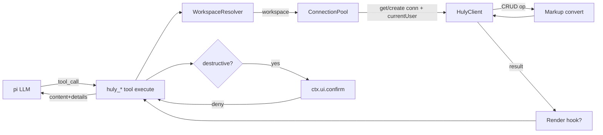
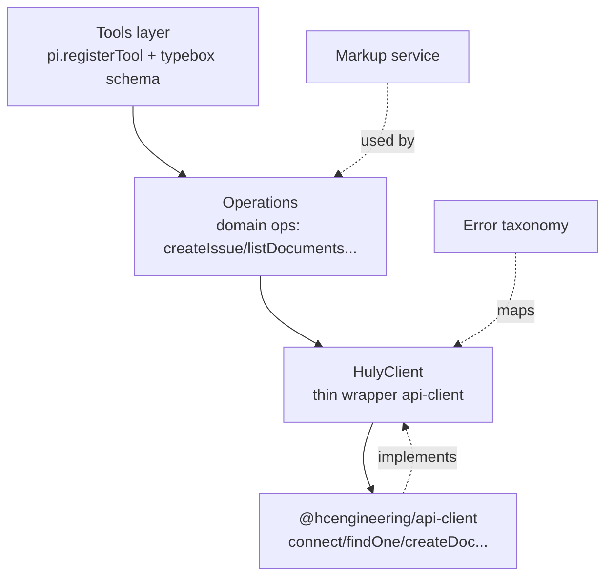
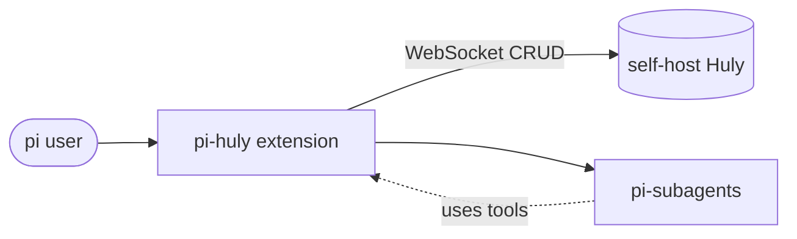
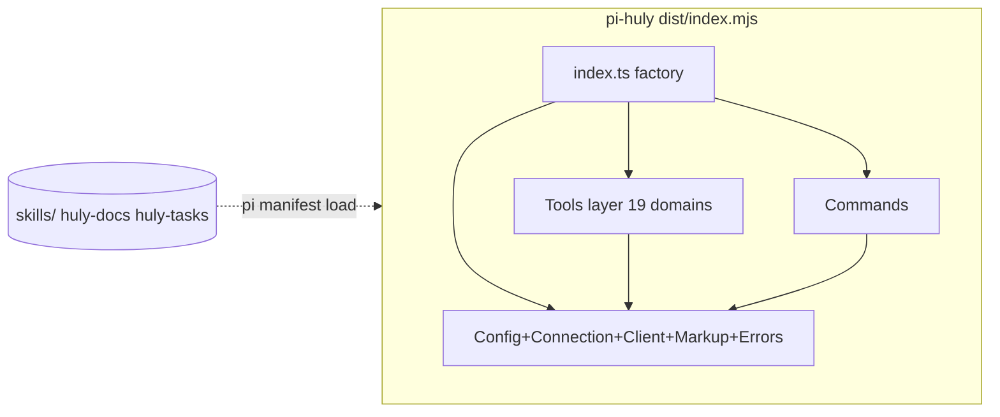
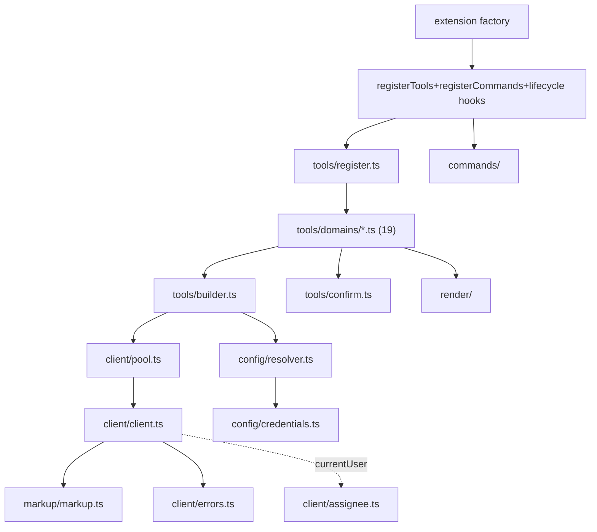

# pi-huly — System & Component Design

> Bước 4/10. Interface level (KHÔNG impl code — design-vs-implementation rule).
> Trace tech stack ([03](./03-tech-stack.md)) + ADR ([01](./01-vision.md)). R1-R6
> (03) ảnh hưởng component design.

## 1. Bounded Context (DDD)

| Context | Trách nhiệm | Boundary | Integrates with |
|---|---|---|---|
| **Config/Auth** | Lưu + resolve credentials per-workspace (auth union: token \| email+password), workspace selection chain, interactive add | không gọi Huly, chỉ IO file + prompt | ConnectionPool, Commands |
| **Connection** | WS pool keyed by workspace, lazy connect, currentUser fetch, reconnect, LRU, cleanup | sở hữu api-client `connect` lifecycle | Tools (qua HulyClient) |
| **Client** | Thin wrapper api-client → typed operations (CRUD + domain), markup hook, currentUser cache | wrap `@hcengineering/api-client` | Tools, Markup |
| **Markup** | markdown ↔ Huly markup round-trip, browse-URL native ref | pure transform, không state | Client, Tools |
| **Tools** | ~102 native pi tools (19 domain modules), schema + execute + assignee default | đăng ký qua `pi.registerTool` | Client, Markup, Confirm, Render |
| **Errors** | Taxonomy + classification từ api-client/PlatformError, mapping tool result | pure | Tools, Client |
| **Commands** | unified `/huly` (init/status/workspace/link/unlink subcommands) | đăng ký `pi.registerCommand` | Config, Connection |
| **Skills** | huly-docs + huly-tasks bundled (adapted prefixed names) | declarative qua package manifest `pi.skills` | — (pi load) |
| **Render** | TUI custom render 3 high-value tools | `renderResult` hook | Tools |

## 2. Data Flow Diagram (tool call)



## 3. Error Taxonomy & Propagation

| Error class | Ví dụ | Source | Propagation (tool result) |
|---|---|---|---|
| `AuthError` | token hết hạn, workspace sai | api-client `PlatformError` status Unauthorized/TokenExpired | `isError:true`, "Auth failed: <class>. Check token (/huly init)" |
| `ConnectionError` | Huly unreachable, WS drop, timeout | network / WS close | retry ≤3 w/ backoff (idempotent op only); fail → `isError:true` "Huly unreachable: <url>" |
| `NotFoundError` | issue/doc/milestone _id không tồn | api-client findOne null | `isError:true` "<Type> not found: <id>" |
| `ConflictError` | duplicate, race, edit_document multiple match | api-client status Conflict / edit old_text multi-match | `isError:true` "Conflict: <detail>" (gợi ý replace_all) |
| `ValidationError` | sai param, status invalid cho task type | schema (typebox) pre-execute | auto-reject trước execute (pi schema validation) |
| `InternalError` | markup convert fail, unexpected | catch-all | `isError:true` "Internal: <class>" + log stack (KHÔNG leak token) |
| `ExternalError` | @hcengineering dep throw wrapped | dep boundary | unwrap → map vào class trên |

> Error KHÔNG leak: token, internal _class names, stack ra LLM. Structured log
> (workspace, tool, errorClass, latency) — KHÔNG PII/secret.

## 4. Architecture Principles

### Layer Diagram (Clean Architecture, adapted cho extension)



**Dependency rule**: Tools → Ops → Client → Infra. Markup/Errors cross-cutting.
Domain ops KHÔNG import pi types (chỉ typebox output). Infra (api-client) KHÔNG
leak lên Ops (Client wrap + map error).

### SOLID Checklist

| Nguyên tắc | Dấu hiệu vi phạm | Fix (áp dụng pi-huly) |
|---|---|---|
| SRP | 1 module >1 việc | Mỗi domain module (issues.ts, documents.ts...) = 1 responsibility. ConnectionPool chỉ quản conn, KHÔNG gọi domain logic. |
| OCP | Thêm tool phải sửa core | `toolBuilder` + domain modules đăng ký độc lập; thêm domain = thêm file, không sửa register.ts core logic (chỉ import). |
| LSP | — | N/A (không subclassing nặng) |
| ISP | Tool depend method không dùng | HulyClient expose grouped methods theo domain; tool chỉ import cái cần. |
| DIP | Domain import api-client | Ops depend `HulyClient` interface (port), impl là wrapper api-client (infra). Test mock HulyClient. |

### DDD Building Blocks (Huly domain, read-only model)

| Block | Định nghĩa | Ví dụ (pi-huly) |
|---|---|---|
| Entity | object có identity | Issue, Document, Milestone, Project (Huly objects, KHÔNG tạo — wrap) |
| Value object | immutable, compare value | WorkspaceRef, IssueIdentifier, MarkupString, AssigneeRef |
| Domain service | logic cross-entity | `IssueOperations` (create + setMilestone + setComponent + addLabel), `MarkupConverter`, `AssigneeResolver` |
| Repository (port) | interface load/save | `HulyClient` (port), api-client (infra impl) |
| Domain event | — | N/A (pi-huly request-response, KHÔNG event) |

## 5. C4 Architecture

### Level 1 — Context



### Level 2 — Container (1 process, pi-huly bundled module)



### Level 3 — Component (trong container)



## 6. Module Contracts (public API — interface level)

> Mỗi module = 1 responsibility + public API (signature). Impl → Bước 9 task.
> Field chưa chốt → TBD.

### `config/credentials.ts` — CredentialStore (secret, global-only)

| Export | Signature (interface) | Responsibility |
|---|---|---|
| `loadCredentials` | `(filePath?: string) => Promise<Credentials>` | Đọc `~/.pi/agent/huly/credentials.json` (global), chmod 600 verify. `filePath?` optional override cho test. |
| `saveCredentials` | `(c: Credentials, filePath?: string) => Promise<void>` | Write atomic + chmod 600. `filePath?` optional override. |
| `addWorkspace` | `(id: string \| undefined, { url, workspace, ...auth }: WorkspaceCreds, filePath?: string) => Promise<void>` | Add/update entry. `id`=local handle (default=workspace name khi `undefined`); `workspace`=Huly name **BẮT BUỘC**; `auth`=`{token}` XOR `{email,password}` (partial fields rejected). |
| `removeWorkspace` | `(id: string, filePath?: string) => Promise<void>` | Remove entry (+ connection evict). No-op nếu id không tồn tại. |
| `getWorkspace` | `(id: string, filePath?: string) => Promise<WorkspaceCreds \| undefined>` | Lookup by handle. Async (fs I/O). |
| `findByName` | `(name: string, filePath?: string) => Promise<Array<WorkspaceCreds & { id }>>` | Tìm theo Huly workspace name → trả nhiều nếu same-name diff-URL (disambiguate). Async (fs I/O). |
| type `WorkspaceCreds` | `{ url: string, workspace: string } & ({ token: string } \| { email: string, password: string })` | workspace BẮT BUỘC; auth union (XOR strict — partial fields rejected) |
| type `Credentials` | `{ version: 1, workspaces: Record<string, WorkspaceCreds> }` | — |

> **Impl note (T-02)**: Mọi function async (fs I/O non-blocking). `filePath?` optional
> param để inject temp path cho test (dependency injection). Default `= CREDENTIALS_PATH`
> constant. XOR strict: partial email/password (one without other) → rejected để tránh
> silently persist thừa field.

### `config/config.ts` — ConfigStore (non-secret, global)

| Export | Signature | Responsibility |
|---|---|---|
| `loadConfig` | `(filePath?: string) => Promise<Config>` | Đọc `~/.pi/agent/huly/config.json` (global). `filePath?` optional override cho test. |
| `saveConfig` | `(c: Config, filePath?: string) => Promise<void>` | Write atomic. `filePath?` optional override. |
| `bindProject` | `(cwd: string, { workspace, project }: ProjectBinding, filePath?: string) => Promise<void>` | Set `projects[cwd]` (cho `/huly link`/`init`). Upsert. |
| `unbindProject` | `(cwd: string, filePath?: string) => Promise<void>` | Remove `projects[cwd]` (`/huly unlink`). No-op nếu không tồn tại. |
| `resolveByCwd` | `(cwd: string, filePath?: string) => Promise<ProjectBinding \| undefined>` | Longest-prefix match cwd → binding (path normalized). Async. |
| type `Transport` | `'ws' \| 'rest'` | Global toggle (D3). Default `'ws'`. |
| type `ProjectBinding` | `{ workspace: string, project: string }` | cwd binding entry. `workspace` = id-handle (credentials key). |
| type `Config` | `{ version: 1, transport?: Transport, projects: Record<string, ProjectBinding>, pool?: { maxSize?: number } }` | `transport` optional (default `'ws'` per D3). |

### `config/resolver.ts` — WorkspaceResolver + ProjectResolver

| Export | Signature | Responsibility |
|---|---|---|
| `resolveWorkspace` | `(explicit?: string, ctx: ResolverCtx) => Promise<string>` | Chain (no env): explicit param > cwd-map (config.resolveByCwd) > throw `NeedsInitError`. `explicit`/lookup name → nếu 1 entry → dùng; nhiều (same-name diff-URL) → throw `NeedsDisambiguationError` với list (caller prompt chọn url). |
| `resolveProject` | `(explicit?: string, ctx: ResolverCtx) => Promise<string \| undefined>` | Chain: explicit param > cwd-map (config.resolveByCwd). Undefined → return undefined (caller prompt chọn từ `list_projects`). |
| type `ResolverCtx` | `{ cwd: string, credentialsPath?: string, configPath?: string }` | Inject paths cho testability (path-injection thay vì function-injection — ít mock boilerplate). Default: `CREDENTIALS_PATH` / `CONFIG_PATH`. |
| class `NeedsDisambiguationError` | `extends Error { matches: Array<{id, url, workspace}> }` | Caller catch → prompt user chọn 1 trong matches (same-name diff-URL). |
| class `NeedsInitError` | `extends Error` | Caller catch → run `/huly init` flow. |

### `client/pool.ts` — ConnectionPool (module singleton, shared subagents)

| Export | Signature | Responsibility |
|---|---|---|
| `getClient` | `(workspace: string) => Promise<HulyClient>` | Lazy create client theo global `transport` (config.json, D3): ws = `connect` persistent + pool/LRU (NFR-11, default 8) + auto-reconnect; rest = `connectRest` stateless (cached instance, no persistent conn). Reuse across subagent (D14, ws only). On create → fetch+cache currentUser. |
| `closeAll` | `() => Promise<void>` | session_shutdown cleanup (FR-12) |
| `health` | `(workspace?: string) => Promise<HealthStatus & { user?: { id, name, email } }>` | cho `/huly` diagnostics + currentUser verify |

> Pool state = module-level (KHÔNG per-session) → subagent shared (D14).
> Reconnect/backoff inside `getClient` (NFR-03). Concurrency: Huly WS multiplex
> requests — verify R-test Bước 9.

### `client/client.ts` — HulyClient (port, thin wrapper)

> **Reconciled T-05 (evidence từ api-client@0.7.423 real API)**: api-client
> export `connect(url, options)` / `connectRest(url, options)` — url tách riêng.
> `getCurrentUser`/`get_user_profile` KHÔNG tồn tại → dùng `client.getAccount()`.
> Types từ `@hcengineering/core` (Ref/Doc/Account/TxOperations), KHÔNG platform.
> REST write cần `createRestTxOperations` riêng (RestClient chỉ read-only).

| Export | Signature (subset) | Responsibility |
|---|---|---|
| `createHulyClient` | `(creds: HulyCredentials, transport?: 'ws'\|'rest') => Promise<HulyClient>` | `connect(url, options)` (ws) hoặc `connectRest` + `createRestTxOperations` (rest). `HulyCredentials = {url} & AuthOptions` (D8 auth union). Default `'ws'`. |
| `client.findOne` / `findAll` | `<T extends Doc>(_class: Ref<Class<T>>, query: DocumentQuery<T>, options?) => Promise<...>` | delegate PlatformClient (ws) hoặc RestClient (rest) + markup on read fields (T-08a) |
| `client.createDoc` / `updateDoc` / `removeDoc` | `(...)` | delegate PlatformClient (ws) hoặc TxOperations (rest) + markup on write fields |
| `client.addCollection` / `createMixin` | `(...)` | cho comments/labels/relations (delegate ws hoặc TxOperations rest) |
| domain methods | `createIssue(p): Promise<Ref>`, `listIssues(filter): Promise<Issue[]>`, ... | typed ops, 19 domain — generic CRUD + class refs (M2 tools layer) |
| `client.getCurrentUser` | `() => Promise<{ id: string, name: string, email: string }>` | cached sau connect — wrap `client.getAccount()` (map Account → {id, name, email}) — default assignee (D15) |
| `client.getAccount` | `() => Promise<Account>` | passthrough api-client getAccount |
| `close` | `() => Promise<void>` | ws → PlatformClient.close(); rest → no-op (stateless) |
| type `Transport` | `'ws' \| 'rest'` | Global toggle (D3). Default `'ws'`. |
| type `HulyCredentials` | `{ url: string } & AuthOptions` | url tách + auth union (token \| email+password) + workspace BẮT BUỘC |

> Domain methods (createIssue, getDocument, addComment, logTime...) = typed façade
> trên generic CRUD (M2). ~102 tool map 1:1 tới method. Markup convert auto cho
> description/content fields.

### `client/assignee.ts` — AssigneeResolver (NEW, auto-resolve name)

| Export | Signature | Responsibility |
|---|---|---|
| `resolveAssignee` | `(workspace: string, input?: string) => Promise<AssigneeRef>` | `input` given → validate (email hoặc `LastName,FirstName`) + lookup `list_employees` nếu cần; `input` absent → default `pool.getClient(workspace).getCurrentUser()` (email). Trả AssigneeRef cho `assignee` field. |
| type `AssigneeRef` | `{ email: string, name: string, personId: Ref }` | map tới huly-tasks `claim`/`assignee` format |

> Map tới huly-tasks skill `getCurrentUser()` → get_user_profile. Auto-resolve
> user name/email KHÔNG store trong credentials.json (single source = Huly).

### `client/errors.ts` — HulyError taxonomy

| Export | Signature |
|---|---|
| `class HulyError` | base, `{ class: ErrorClass, message, cause? }` |
| `mapError(e: unknown): HulyError` | classify api-client/PlatformError → Auth/Connection/NotFound/Conflict/Internal |
| `toToolResult(err: HulyError)` | → `{ content, isError:true }` (KHÔNG leak token/stack) |

### `markup/markup.ts` — MarkupConverter

> Parser = `@hcengineering/text-markdown` (`markdownToMarkup`/`markupToMarkdown`,
> verified export cả 2 chiều). **Native-ref transform (`transformBrowseUrl`) =
> reimplement HOẶC vendor từ huly-mcp (MIT)** — KHÔNG text-markdown built-in
> (audit UC-03, R8).

| Export | Signature | Responsibility |
|---|---|---|
| `mdToMarkup` | `(md: string) => string` | markdown → Huly markup (text-markdown parser) + native-ref transform (md link `_class/_id/_label` → native ref) |
| `markupToMd` | `(markup: string) => string` | inverse (text-markdown parser) + native-ref → md link |
| `transformBrowseUrl` | `(node, opts) => node` | native-ref transform (reimplement/vendor) — walk markup node tree |

### `tools/builder.ts` — toolBuilder

| Export | Signature | Responsibility |
|---|---|---|
| `defineHulyTool` | `<P>(opts: { name, description, promptSnippet?, promptGuidelines?, parameters: TObject, handler: (params, ctx, client) => Promise<ToolResult>, destructive?, render? }) => ToolDef` | Helper: prefix `huly_`, wire workspace resolve + getClient + error map + confirm gate + render + assignee default. Domain module chỉ khai báo opts. |

> `defineHulyTool` = single seam. Mỗi tool = 1 declaration. FR-02 (prefix), FR-06
> (resolve), FR-09 (confirm), FR-14 (error map), FR-16 (render) tập trung đây.

### `tools/confirm.ts` — confirmGate

| Export | Signature |
|---|---|
| `confirmDestructive` | `async (ctx, { type, id, detail }) => boolean` - ctx.ui.confirm; non-TUI (print/json/CI, `ctx.hasUI===false`) → false (auto-deny, KHÔNG bypass) |

### `tools/domains/*.ts` — 19 domain modules

Mỗi export `tools: ToolDef[]`. VD `issues.ts` export 21 tools (list/get/create/
update/delete/move + labels + templates + relations + doc-link). Handler map tới
`HulyClient` method. Không logic business — chỉ schema + delegate.

| Domain module | Tools | Map tới HulyClient |
|---|---|---|
| documents.ts | 10 | createTeamspace/listDocuments/editDocument... |
| issues.ts | 21 | createIssue/listIssues/addIssueRelation... |
| milestones.ts | 6 | createMilestone/setIssueMilestone... |
| (16 còn lại) | ~65 | (tương tự, full CRUD per domain) |

### `commands/huly.ts` — unified `/huly` (git-like subcommands)

| Subcommand | Behavior |
|---|---|
| `/huly` (no arg) | smart: cwd bound → status; unbound → init flow |
| `/huly init` | setup/bind cwd: prompt workspace name → check trùng (findByName, same-name diff-URL disambiguate) → add nếu mới (url+token) → verify token (get_user_profile) → list_projects → link/create project → `config.bindProject(cwd)` |
| `/huly status` | diagnostics: pool.health, current binding (cwd→ws+project), user, token verify, version |
| `/huly workspace list\|add\|remove` | global workspace CRUD (credentials.ts) |
| `/huly link [ws] [project]` | bind cwd (manual) → config.bindProject |
| `/huly unlink` | remove cwd binding → config.unbindProject |

> 1 command registration với subcommand dispatch. Replaces `/huly-workspace` +
> `/huly-status` (fold).

### `render/issue.ts` + `render/document.ts`

| Export | Signature |
|---|---|
| `renderIssueResult` | `(result, opts, theme) => Component` (issue card: id/title/status/labels/assignee/milestone) |
| `renderIssueListResult` | `(result, opts, theme) => Component` (compact table) |
| `renderDocumentResult` | `(result, opts, theme) => Component` (title + first lines preview) |

> Default text render cho ~99 tool còn lại (pi fallback).

### `index.ts` — extension factory

```typescript
// interface only — impl Bước 9
export default function (pi: ExtensionAPI): void | Promise<void>
// — registerTools (19 domains) via builder
// — registerCommand /huly (unified subcommands)
// — session_shutdown hook → pool.closeAll()
// — (skills qua package manifest, KHÔNG resources_discover)
```

## 7. Package manifest (package.json `pi`)

```json
{
  "name": "pi-huly",
  "keywords": ["pi-package"],
  "pi": {
    "extensions": ["./dist/index.mjs"],
    "skills": ["./skills"]
  }
}
```

> Skills declarative qua manifest (pi auto-load). Extension entry = bundled
> `dist/index.mjs`.

## 8. Trace ADR → Component

| ADR | Component implement |
|---|---|
| D1/D10 | client/client.ts (thin wrapper, no Effect) |
| D3/D14 | client/pool.ts (WS pool, shared singleton, currentUser fetch) |
| D4/D5 | tools/domains/* + builder.ts (prefix huly_) |
| D8/D11 | config/credentials.ts + config/config.ts + resolver.ts (cwd-map) + commands/huly.ts (unified) |
| D9 | tools/confirm.ts |
| D12 | render/*.ts (3 tools) |
| D13 | Superseded by D11 — fold vào `/huly status` |
| D15/FR-18 | client/assignee.ts (auto-resolve currentUser → default assignee) |

## 9. Risk carry-forward (R1-R6 → verify Bước 9 impl)

- R2 (ws native deps) → pool.ts bundle test.
- R3 (rolldown externals) → build smoke.
- R4 (nub build scripts) → install test.
- R6 (TS 7 types) → typecheck pi-huly.

---

_Exit criteria Bước 4: mọi component có Module Contract (public API) ✓; error
taxonomy + propagation rõ ✓; bounded context list ✓; component names khớp ADR
✓; SOLID checklist áp dụng ✓._
