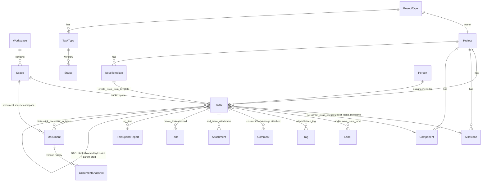

# pi-huly — Data Model & Protocols

> Bước 5/10. **pi-huly KHÔNG owns data** — Huly owns storage. Doc = entity shapes
> (read model interface, audited vs api-client thật) + relations + pi-huly OWN
> config schemas + validation. KHÔNG DDL Huly. Trace [04](./04-system.md).

## 1. Data Model (ERD) — Huly domain pi-huly touches



> pi-huly wrap object này (read-only model). KHÔNG create schema mới trong
> Huly — chỉ thao tác object có sẵn qua api-client.

## 2. Entity Shapes (interface level — audited vs api-client thật)

> _class refs từ `@hcengineering/{tracker,task,contact,document,chunter,
attachment,tags,view,core}`. Field type chi tiết → Bước 9. Doc chỉ entity
> shape. Audited vs huly-mcp `src/domain/schemas/*.ts` (mirror api-client
> types). Read model dùng **friendly identifier** (string), KHÔNG raw Ref
> (trừ `id`/`issueId` dual).

### `Issue` (`tracker.class.Issue`)

```typescript
interface Issue {
  issueId: string; // raw _id
  identifier: string; // "PD-123" friendly
  title: string; // Huly cho phép empty
  description?: string; // Huly markup (FR-13 convert)
  status: string; // StatusName; statusCategory DERIVED (filter param)
  priority?: "urgent" | "high" | "medium" | "low" | "no-priority";
  assignee?: string; // PersonName "LastName,FirstName"
  assigneeRef?: PersonRef; // {id, name?, email?} — D15
  labels?: { title: string; color?: ColorCode }[];
  project: string; // ProjectIdentifier "PD"
  parentIssue?: string; // IssueIdentifier
  subIssues?: number; // count
  dueDate?: number | null;
  estimation?: number; // minutes
  modifiedOn?: number;
  createdOn?: number;
  // milestone/components/tags/reporter: KHÔNG inline read model — relation-only (§3)
}
```

### `Document` (`document.class.Document`) — space = teamspace

```typescript
interface Document {
  id: string;
  title: string;
  content?: string; // markup
  teamspace: string; // name/id (KHÔNG Ref<Space>)
  url: string; // browse URL — FR-13 interlink
  modifiedOn?: number;
  createdOn?: number;
}
interface TeamspaceSummary {
  id: string;
  name: string;
  description?: string;
  archived: boolean;
  private: boolean;
}
```

### `Milestone` (`tracker.class.Milestone`)

```typescript
interface Milestone {
  id: string;
  label: string;
  description?: string;
  status: "planned" | "in-progress" | "completed" | "canceled";
  targetDate: number;
  project: string; // ProjectIdentifier
  modifiedOn?: number;
  createdOn?: number;
}
```

### `Project` / `ProjectType` / `TaskType` / `Status`

```typescript
interface Project {
  identifier: string;
  name: string;
  description?: string;
  archived: boolean;
  defaultStatus?: string;
  statuses?: string[];
}
interface ProjectType {
  _id: Ref;
  targetClass: Ref;
  taskTypes: Ref<TaskType>[];
}
interface TaskType {
  _id: Ref;
  name: string;
  statuses: Ref<Status>[];
}
interface Status {
  _id: Ref;
  name: string;
  category: StatusCategory;
  ofTaskType: Ref<TaskType>;
}
```

### `Component` (`tracker.class.Component`)

```typescript
interface Component {
  id: string;
  label: string;
  description?: string;
  lead?: string /*PersonName*/;
  project: string; /*ProjectIdentifier*/
}
```

### `Label` / `Tag` / `TagCategory`

```typescript
interface Label {
  title: string;
  color?: ColorCode;
} // summary minimal; full trên tag def (description/category)
interface Tag {
  _id: Ref;
  title: string;
  color?: ColorCode;
  space: Ref<Space>;
}
interface TagCategory {
  _id: Ref;
  title: string;
  targetClass: Ref;
  space: Ref<Space>;
}
```

### `Comment` (`chunter.class.ChatMessage`) / `Attachment` / `Todo` / `TimeSpendReport`

```typescript
interface Comment {
  id: string;
  message: string /*inline Markup, KHÔNG "body" — T-70 fix*/;
  author?: string;
  authorId?: string;
  createdOn?: number;
  modifiedOn?: number;
  editedOn?: number | null;
}
interface Attachment {
  _id: Ref;
  name: string;
  contentType: string;
  attachedTo: Ref;
  size: number;
  file?: Blob;
}
interface Todo {
  title: string;
  attachedTo: { type: "issue"; project: string; identifier: string };
  done?: boolean;
  owner?: string;
  dueDate?: number;
}
interface TimeSpendReport {
  value: number /*minutes*/;
  description?: string;
} // attachedTo=Issue, user implicit
```

### `Person` (`contact.class.Person`) — assignee / currentUser

```typescript
interface Person {
  id: string;
  name: string; // "LastName,FirstName"
  firstName?: string;
  lastName?: string;
  email?: string; // key cho D15 assignee resolution
  city?: string;
  channels?: ChannelSummary[];
  organizations?: OrgMembership[];
  url: string; // browse URL
}
interface PersonRef {
  id: string;
  name?: string;
  email?: string;
} // assigneeRef
```

## 3. Relations (2 hệ thống độc lập — khớp huly-tasks)

| Loại                                   | Tool                                                  | Shape                                                  | Ghi chú                            |
| -------------------------------------- | ----------------------------------------------------- | ------------------------------------------------------ | ---------------------------------- |
| **DAG dependency**                     | add/remove/list_issue_relation                        | `Issue --[blocks\|is-blocked-by\|relates-to]--> Issue` | native cross-project               |
| **Parent-child**                       | move_issue / create_issue(parentIssue)                | `Issue ⊃ Issue` (epic/sub)                             | promote top-level = newParent=null |
| **Doc↔issue**                          | link/unlink_document_to_issue                         | `Issue ↔ Document`                                     | native Relations panel             |
| **Issue↔milestone**                    | set_issue_milestone                                   | `Issue → Milestone`                                    | —                                  |
| **Issue↔component**                    | set_issue_component                                   | `Issue → Component`                                    | —                                  |
| **Issue↔label**                        | add/remove_issue_label                                | `Issue ↔ Label` (**global!**)                          | namespace prefix                   |
| **Issue↔tag**                          | attach/detach_tag                                     | `Issue ↔ Tag` (project-scoped)                         | —                                  |
| **Comment/attachment/todo/time↔issue** | add_comment/log_time/create_todo/add_issue_attachment | attachedTo=Issue                                       | collection pattern                 |

## 4. Config Schemas (pi-huly OWN data — global-only, D8)

> Global only: `~/.pi/agent/huly/`. KHÔNG env vars, KHÔNG project-local
> override. Secret/non-secret tách 2 file.

### `credentials.json` (secret, chmod 600) — auth union (token OR email/password)

```json
{
  "version": 1,
  "workspaces": {
    "myteam": { "url": "https://huly.a.com", "workspace": "myteam", "token": "..." },
    "corp-prod": {
      "url": "https://huly.corp.com",
      "workspace": "corp",
      "email": "...",
      "password": "..."
    },
    "corp-stg": { "url": "https://huly.stg.com", "workspace": "corp", "token": "..." }
  }
}
```

- **Key = local handle `id`** (default = workspace name).
- **`workspace` field BẮT BUỘC** — Huly workspace name truyền `connect`/
  `connectRest` (mọi auth đều cần). **Same-name diff-URL** → id distinct
  (`corp-prod`/`corp-stg`), `workspace` giữ tên Huly thật (`corp`). ⭐
- **auth = union**: mỗi entry `{url, workspace}` + (`{token}` XOR
  `{email,password}`). `/huly init` cho chọn (FR-20). api-client `connect` hỗ
  trợ cả 2.
- chmod 600, KHÔNG commit.

### `config.json` (non-secret) — transport + cwd project binding

```json
{
  "version": 1,
  "transport": "ws",
  "projects": {
    "/Users/me/Projects/myapp": { "workspace": "myteam", "project": "APP" },
    "/Users/me/Projects/website": { "workspace": "myteam", "project": "WEB" }
  },
  "pool": { "maxSize": 8 }
}
```

- **`transport`** (global, D3): `"ws"` (default, `connect` persistent + pool) |
  `"rest"` (`connectRest` stateless, no pool).
- **`projects`**: key = absolute project path, value = `{ workspace: <id-handle>, project: <Huly-project-identifier> }`.
- Match = **longest-prefix** (cwd `/app/src` → match `/app`).
- `pool.maxSize` = connection pool cap (NFR-11, default 8, **ws only**).

### Resolution chain (FR-06 — simplified, no env)

1. per-call `workspace?` / `project?` param (explicit override)
2. **cwd mapping** (config.json `projects`, longest-prefix) → workspace id + project ⭐
3. **interactive `/huly init` prompt** (bind cwd)

> Disambiguation: per-call `workspace`/lookup name → nếu id maps 1 entry →
> dùng; nếu cùng tên nhiều url → prompt chọn url.

### Confirm gate non-TUI (safety)

- `ctx.hasUI === false` (print/json/CI) → **auto-deny delete** (KHÔNG bypass).
  Delete chỉ TUI.

## 5. Validation Rules

| Field                      | Rule                                                           | Error                     |
| -------------------------- | -------------------------------------------------------------- | ------------------------- |
| `workspace` (id handle)    | non-empty, match key trong credentials.json                    | NotFoundError             |
| `url`                      | valid http(s); `huly.app` → warn (FR-15)                       | ValidationError           |
| `token`                    | non-empty                                                      | AuthError nếu Huly reject |
| `identifier` (issue)       | `<PROJECT>-<num>` (vd `PD-123`) HOẶC raw num                   | NotFoundError             |
| `assignee`                 | email (preferred, D15) HOẶC `LastName,FirstName` (KHÔNG space) | Person not found          |
| `priority`                 | enum `urgent\|high\|medium\|low\|no-priority`                  | ValidationError           |
| `statusCategory`           | enum `UnStarted\|ToDo\|Active\|Won\|Lost`                      | ValidationError           |
| `targetDate` (milestone)   | Unix ms, BẮT BUỘC                                              | ValidationError           |
| `color` (label/tag)        | palette index HOẶC hex                                         | ValidationError           |
| `milestone status`         | enum `planned\|in-progress\|completed\|canceled`               | ValidationError           |
| project `identifier`       | 1-5 chars uppercase, start letter                              | ValidationError           |
| `old_text` (edit_document) | match exactly 1; multiple → ConflictError (gợi ý replace_all)  | ConflictError             |
| destructive op (delete_*)  | confirm gate (FR-09); non-TUI auto-deny                        | deny → no-op              |

## 6. Migration Strategy

- **Huly domain data**: pi-huly KHÔNG owns → KHÔNG migration. Huly tự quản
  schema.
- **pi-huly config** (`credentials.json` + `config.json`): forward-compatible
  qua `version` field. v1 = current. Future schema change → bump version +
  migrator. KHÔNG expand/contract (config local, single node).
- **Tool schema (typebox)**: `prepareArguments` shim (pi feature) cho
  backward-compat khi đổi param shape session cũ resume.

## 7. Protocols

- **Wire**: pi-huly KHÔNG định nghĩa protocol riêng. Dùng
  `@hcengineering/api-client` WebSocket (JSON-RPC over WS) —
  connect/findOne/findAll/createDoc/updateDoc/removeDoc/addCollection/createMixin.
  Framing + auth handled by api-client.
- **Markup wire**: Huly markup (internal DSL) ↔ markdown (FR-13) qua
  `@hcengineering/text-markdown`. Browse-URL native reference = markdown link
  có `_class`/`_id`/`label` → Huly auto-convert native ref.
- **pi ↔ extension**: pi tool protocol (`registerTool` execute →
  `{content, details, isError}`). pi ↔ skills = markdown SKILL.md (declarative,
  package manifest).

## 8. Trace

| Doc section                                  | Requirement/ADR                   |
| -------------------------------------------- | --------------------------------- |
| §1-2 entity shapes                           | FR-04 (19 domain), D4             |
| §3 relations                                 | FR-04, huly-tasks 2-hệ thống      |
| §4 credentials.json (id handle + workspace?) | FR-05, D8                         |
| §4 config.json (projects cwd-map + pool)     | FR-06, D8                         |
| §5 validation                                | FR-14 (error class), D9 (confirm) |
| §5 assignee format                           | FR-18, D15                        |
| §6 migration                                 | NFR-09 (forward-compat)           |
| §7 protocol                                  | FR-03 (WS api-client), D3, D10    |

---

_Exit criteria Bước 5: schema + indexes + migration strategy rõ ✓; không data
duplication giữa 05 và 04 ✓ (04 = component contracts, 05 = entity/config
shape)._
