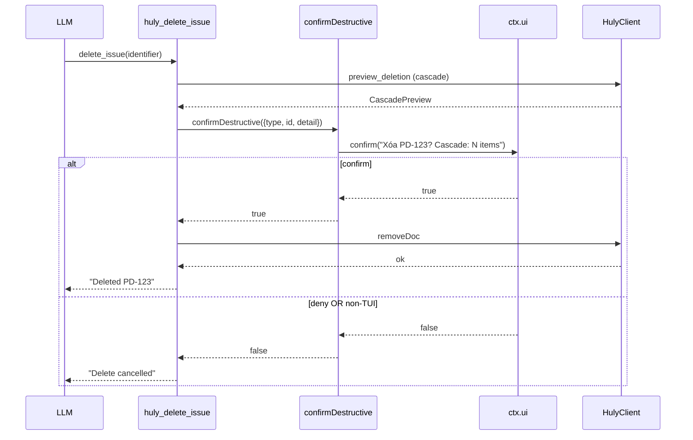

# pi-huly — API & Interface Spec

> Bước 6/10. pi-huly "API" = native pi tools + `/huly` command + error envelope.
> Interface level (typebox schema signature), KHÔNG full param detail 102 tools
> (đó Bước 9 task). Ref [04](./04-system.md) (module contracts) + [05](./05-data-model.md)
> (entity shapes).

## 1. Tool Interface Pattern (single seam)

Mọi tool qua `defineHulyTool` (04 §6):

```typescript
defineHulyTool({
  name: "huly_create_issue",           // prefix huly_ bắt buộc (D5)
  description: "...",                  // cho LLM
  promptSnippet: "Create Huly issue",  // 1 dòng trong system prompt
  promptGuidelines: ["Use huly_create_issue when..."],
  parameters: Type.Object({ ... }),    // typebox schema
  destructive: false,                  // true → confirm gate (FR-09)
  render: undefined,                   // hoặc renderResult hook (D12, 3 tool)
  async handler(params, ctx, client): Promise<ToolResult> { ... }
})
```

Builder tự động: prefix `huly_` · resolve workspace+project (FR-06) · getClient
(pool) · error map (FR-14) · confirm gate nếu `destructive` · assignee default
(FR-18).

## 2. Common Parameters Convention

| Param | Type | Áp dụng | Behavior |
|---|---|---|---|
| `workspace` | string? | mọi tool | override workspace (FR-06 chain); default = cwd-map/`/huly init` |
| `project` | string? | tool theo project (issues/milestones/components/templates) | override Huly project id; default = cwd-map |
| `identifier` | string | get/update/delete issue | `<PROJ>-<num>` (vd `PD-123`) HOẶC raw num |
| `assignee` | string? | create/update issue, log_time | email (preferred, D15) HOẶC `LastName,FirstName`; absent → getCurrentUser().email |
| `priority` | enum | create/update issue | `urgent\|high\|medium\|low\|no-priority` |
| `status` / `statusCategory` | string / enum | list/update issue | status = exact name; statusCategory = `UnStarted\|ToDo\|Active\|Won\|Lost` (derived) |
| `titleSearch` / `contentSearch` | string? | list_documents/issues | substring search (mutually exclusive regex variant) |
| `limit` | int? | list_* | default service-side, pi truncates 50KB/2000 lines |
| `replace_all` | bool? | edit_document | true nếu old_text match nhiều (default false → ConflictError) |
| `targetDate` | int | create_milestone | Unix ms, BẮT BUỘC |

## 3. Result Envelope + Truncation

```typescript
type ToolResult = {
  content: [{ type: "text", text: string }]   // cho LLM, ≤ 50KB / 2000 lines
  details: Record<string, unknown>            // cho render + state (entity objects)
  isError?: boolean                           // builder set từ HulyError
}
```

- Truncate qua pi utils (`truncateHead`/`truncateTail`) — list/logs đầu/cuối.
- Full output → temp file, LLM được báo path.
- `details` mang entity shapes (05 §2) cho `renderResult` (D12).

## 4. Tool Catalog (domain, interface signature representative)

> KHÔNG list 102 tools đầy đủ — đó Bước 9. Đây = interface shape đại diện mỗi
> domain. Param/result interface level (typebox), không impl.

| Domain (tools) | Representative signature (params → result) |
|---|---|
| **Issues** (21) | `huly_create_issue({project, title, description?, priority?, assignee?, status?, taskType?, parentIssue?, dueDate?, estimation?}) → {identifier}` · `huly_list_issues({project, status?, statusCategory?, assignee?, component?, parentIssue?, titleSearch?, limit?}) → Issue[]` · `huly_get_issue({project, identifier}) → Issue` · `huly_update_issue`/`move_issue`/`delete_issue`(destructive) |
| **Milestones** (6) | `huly_create_milestone({project, label, description?, targetDate}) → {id}` · `huly_set_issue_milestone({project, identifier, milestone}) → {}` · list/get/update/delete |
| **Components** (6) | `huly_create_component({project, label, description?, lead?}) → {id}` · `huly_set_issue_component` · list/get/update/delete |
| **Projects** (6) | `huly_create_project({name, identifier}) → {identifier}` · `huly_list_statuses({project}) → Status[]` · get/update/delete |
| **Task-mgmt** (5) | `huly_create_issue_status({project, taskType?, name, category}) → {id}` (idempotent) · `huly_create_task_type` · `huly_list_project_types`/`get_project_type`/`list_task_types` |
| **Documents/Teamspaces** (10) | `huly_create_teamspace({name, description?, private?}) → {id}` · `huly_create_document({teamspace, title, content}) → {id,url}` · `huly_edit_document({document, old_text?, new_text?, content?, replace_all?}) → {}` · `huly_get_document({teamspace, document}) → Document` |
| **Snapshots** (2) | `huly_list_document_snapshots({document}) → Snapshot[]` · `huly_get_document_snapshot({snapshot}) → Document` |
| **Spaces** (5) | `huly_list_spaces`/`get_space`/`list_space_types`/`get_space_type`/`update_space` |
| **Workspace/profile** (5) | `huly_get_workspace_info` · `huly_list_workspaces` · `huly_list_workspace_members` · `huly_get_user_profile`(→getCurrentUser) · `huly_update_user_profile` |
| **Labels** (4) | `huly_create_label({title, color?, description?, category?})`(GLOBAL!) · list/update/delete |
| **Tags** (7) | `huly_create_tag`/`attach_tag`/`detach_tag`/`list_attached_tags` · update/delete/list |
| **Tag-categories** (4) | CRUD `huly_create_tag_category` v.v. |
| **Comments** (4) | `huly_add_comment({project, identifier, body}) → {id}` · list/update/delete |
| **Attachments** (5) | `huly_add_issue_attachment({project, identifier, filename, contentType, filePath?\|fileUrl?\|data?, description?}) → {id}` · list/get/download |
| **Issue relations** (⊂ Issues 21) | `huly_add_issue_relation({project, identifier, targetIssue, relationType: blocks\|is-blocked-by\|relates-to}) → {}` · `huly_list_issue_relations` · `huly_link_document_to_issue` |
| **Search** (1) | `huly_fulltext_search({query, limit?}) → Result[]` (global issues+docs+messages) |
| **Deletion** (1) | `huly_preview_deletion({project, identifier, _class}) → CascadePreview` |
| **Time** (1) | `huly_log_time({project, identifier, value: minutes, description?}) → {}` |
| **Todos** (7) | `huly_create_todo({title, attachedTo:{type:'issue',project,identifier}, description?, owner?, dueDate?}) → {id}` · list/get/update/complete/reopen/delete |
| **Contacts** (2) | `huly_list_employees`/`huly_list_persons` (read, cho assignee resolution) |

> Param name inconsistency package (huly-tasks gotcha): `set_issue_milestone`/
> `set_issue_component`/`move_issue`/`log_time`/`add_issue_attachment` dùng
> `identifier`; `add_comment`/`list_comments`/`list_issue_relations`/
> `link_document_to_issue` dùng `issueIdentifier`. pi-huly **normalize về
> `identifier`** trong interface (builder map ra Huly field đúng) — ẩn
> inconsistency khỏi LLM.
>
> **Ghi chú grouping**: bảng nhóm theo readability. Canonical domain/module
> partition = 01 D4 (19 domain, ~102 tool). "Issue relations" là sub-view
> TRONG Issues domain (21, đã incl add/remove/list_relation + link/unlink
> document), KHÔNG additive — tổng vẫn ~102. Full per-tool param = Bước 9.

## 5. Error Response Format

```json
{
  "content": [{ "type": "text", "text": "AuthError: token expired. Run /huly init to rebind." }],
  "isError": true,
  "details": { "errorClass": "AuthError", "workspace": "myteam" }
}
```

- LLM thấy `text` (human message + recovery hint). `details.errorClass` cho
  render/debug.
- KHÔNG leak: token, raw _class, stack, internal Ref. (04 §3 taxonomy)

## 6. Confirm/Auth Flow (destructive ops)



## 7. `/huly` Command Interface

| Subcommand | Args | Autocomplete | Behavior |
|---|---|---|---|
| `/huly` | — | — | smart (bound→status / unbound→init) |
| `/huly init` | — | — | setup flow: workspace name → check → add/link → verify → project → bind cwd |
| `/huly status` | — | — | diagnostics (connection, binding, user, token, version) |
| `/huly workspace` | `list\|add\|remove` | subcommand + workspace name | global workspace CRUD |
| `/huly link` | `[workspace] [project]` | workspace + project (from list_projects) | bind cwd manual |
| `/huly unlink` | — | — | remove cwd binding |

> `getArgumentCompletions` (pi feature) cho `workspace`/`project` args — query
> credentials/list_projects.

## 8. TUI Render Interface (ref 04 §6)

3 high-value tool có `renderResult` (D12): `huly_get_issue` (card),
`huly_list_issues` (table), `huly_get_document` (preview). Default text cho 99
còn lại. Signature → 04 §6 `render/*.ts`. KHÔNG duplicate.

## 9. Versioning / Deprecation / Idempotency

- **Versioning**: tool name stable (`huly_*`). Param shape change →
  `prepareArguments` shim (pi) cho session cũ resume. Breaking change → bump
  tool name? (KHÔNG, giữ tên + shim).
- **Deprecation**: tool removed → unregister + log warn 1 phiên bản, không im
  lặng.
- **Idempotency**: `create_issue_status` idempotent (normalized name).
  `create_teamspace`/`create_document`/`create_project` idempotent (trả existing
  nếu trùng). `add_issue_relation` no-op nếu tồn tại. Create issue/doc/milestone
  KHÔNG idempotent (mỗi call = new).
- **Rate/Retry**: idempotent op auto-retry ≤3 (04 §3); non-idempotent (create)
  KHÔNG retry (tránh dup).

## 10. Trace

| Section | Requirement/ADR |
|---|---|
| §1-2 tool pattern + common params | FR-02, FR-04, D4, D5 |
| §2 workspace/project param | FR-06, D8, D11 |
| §2 assignee default | FR-18, D15 |
| §3 result envelope | FR-14 |
| §4 catalog (19 domain) | FR-04, FR-17 |
| §5 error format | FR-14, D10 |
| §6 confirm flow | FR-09, D9 |
| §7 /huly command | FR-07, FR-08, D11 |
| §8 render | FR-16, D12 |
| §9 idempotency | NFR-10 |

---

_Exit criteria Bước 6: mọi tool group có interface signature ✓; error response
format rõ ✓; auth flow ref ✓; versioning/deprecation/idempotency chốt ✓; không
API spec trùng giữa 06 và 07 (07 = use case sequence, KHÔNG duplicate tool
list)._
