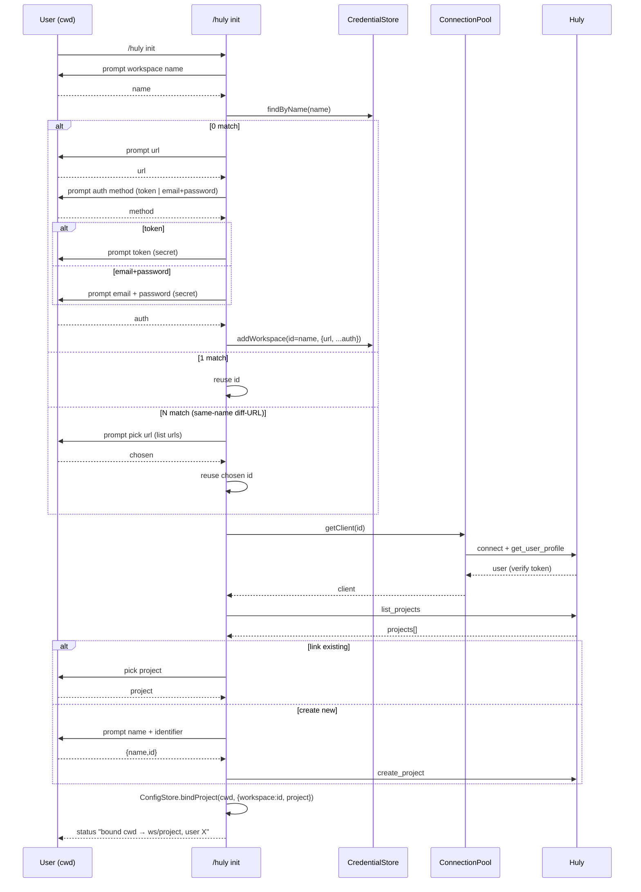

# UC-01: `/huly init` — first-time project setup

> Bước 7/10. Size L — multi-step, branching, multi-system. Trace [04](./04-system.md)
> (config/client modules), [06](./06-api.md) (`/huly` command).

## Overview

User chạy `/huly init` trong project cwd → bind cwd → Huly {workspace, project}.
Trigger: first time dùng pi-huly trong repo, hoặc rebind. Outcome: tools auto-
resolve workspace+project từ cwd.

## Actors & Systems

| Actor/System | Vai trò |
|---|---|
| User (cwd) | chạy `/huly init`, nhập creds/project |
| `/huly` command | orchestrate flow |
| CredentialStore | findByName / addWorkspace (id-handle + workspace? field) |
| ConfigStore | bindProject(cwd) |
| ConnectionPool | getClient (verify token) |
| Huly | get_user_profile (verify), list_projects, create_project |

## Sequence (happy path)

## Error Path

- **token invalid** (AuthError) → retry auth (loop), max 3.
- **Huly unreachable** (ConnectionError) → abort + hint check url/self-host.
- **no projects + create_project fail** → abort.
- **user cancel** → no bind (cwd stays unbound).

## Notes

- id-handle stable; same-name diff-URL disambiguate ONCE tại setup.
- bind persists cwd→{ws,project}; subsequent tool calls auto-resolve (FR-06).
- `findByName` trả array → disambiguate UI chỉ khi >1.
- **auth choice** (FR-20): user chọn token HOẶC email+password khi add workspace;
  api-client `connect` hỗ trợ cả 2.
- transport (ws|rest) = global config.json, KHÔNG chọn per-init.
