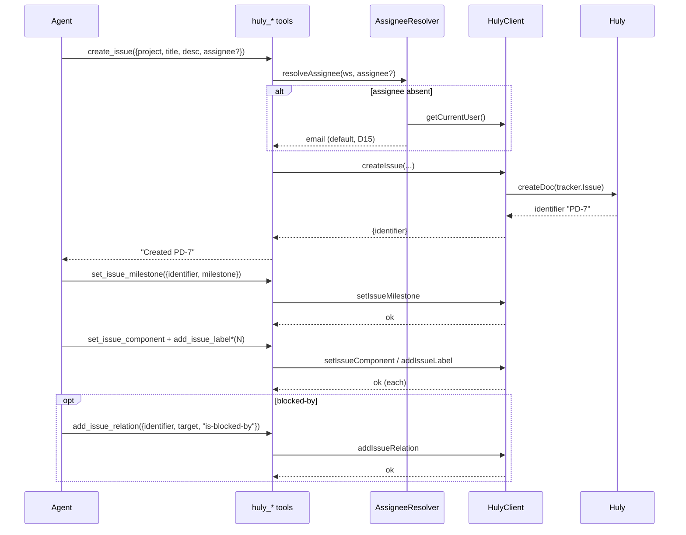

# UC-02: create_issue composite (huly-tasks createTask)

> Bước 7/10. Size L — multi-call orchestration: create + setMilestone +
> setComponent + addLabel(s) + assignee auto-resolve + relation. Partial-failure
> risk. Trace [06](./06-api.md), huly-tasks skill.

## Overview

Agent tạo task đầy đủ (project-design Bước 9): create issue → gán milestone +
component + labels + assignee (auto) + relation. Trigger: bulk issue creation,
task setup. Outcome: issue fully configured.

## Actors & Systems

| Actor/System | Vai trò |
|---|---|
| Agent | orchestrate multi-call |
| huly_create_issue / set_issue_milestone / set_issue_component / add_issue_label / add_issue_relation | tool calls |
| AssigneeResolver | resolveAssignee (D15) |
| HulyClient | CRUD |

## Sequence (happy path)

## Error Path

- **create fails** (Auth/Connection) → no partial state; create **non-idempotent**
  (KHÔNG retry, tránh dup) → abort, agent decides.
- **create OK but setMilestone/setComponent/addLabel fails** → **partial state**
  (issue created, field unset). Agent thấy error → retry set_*/add_label
  (idempotent, retry OK).
- **assignee not found** → ValidationError **trước** create (resolve early,
  fail-fast) — KHÔNG tạo issue rồih mới phát hiện.

## Notes

- create non-idempotent (no retry) · set_*/add_label/add_relation idempotent
  (retry OK).
- assignee resolve EARLY (before create) → fail-fast.
- agent tự orchestrate multi-call (pi-huly KHÔNG batch — 1 tool = 1 op, FR-04
  full CRUD granularity). Lý do: mỗi op distinct error/retry semantics.
