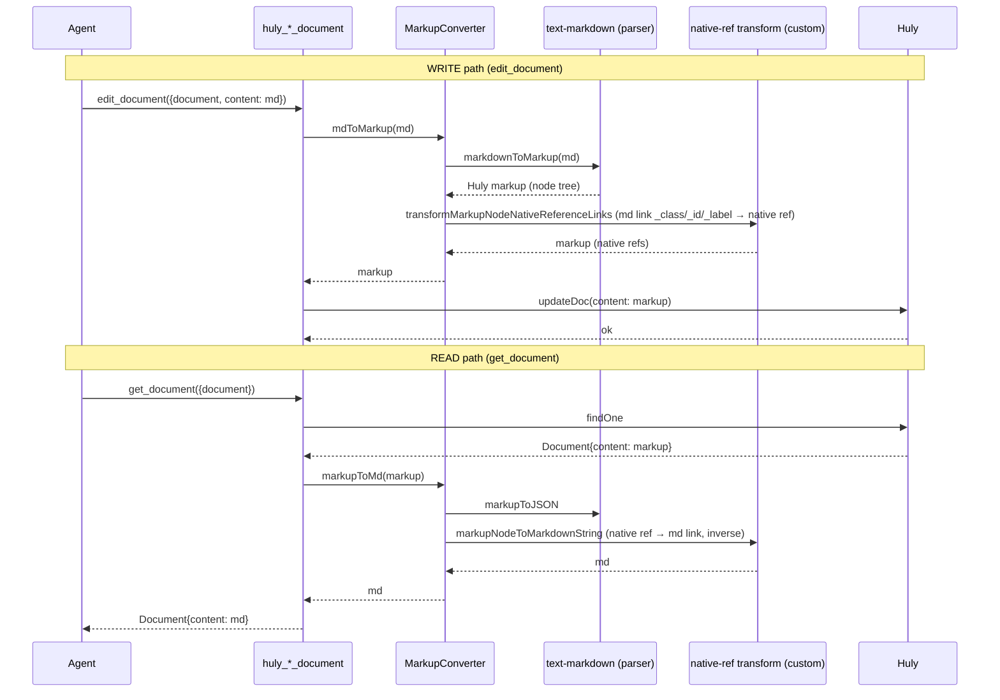

# UC-03: document markdown round-trip

> Bước 7/10. Size L — markup conversion risk hotspot (D10). markdown↔Huly markup
>
> + browse-URL native reference transform. **Audited vs api-client thật**:
> parser = `@hcengineering/text-markdown`; native-ref transform = **huly-mcp
> custom (MIT)**, reimplement hoặc vendor.

## Overview

Agent edit/create document (markdown) → Huly lưu markup → get → markdown lại.
Round-trip fidelity + native reference (browse-URL) ↔ md link.

## Actors & Systems

| Actor/System | Vai trò |
|---|---|
| Agent | edit/get document |
| huly_create/edit/get_document | tool |
| MarkupConverter | mdToMarkup / markupToMd |
| `@hcengineering/text-markdown` | parser (markdownToMarkup/markupToMarkdown) |
| **native-ref transform** (reimplement/vendor) | transformMarkupNodeNativeReferenceLinks + markupNodeToMarkdownString |
| Huly | store markup |

## Sequence

## Error Path / Edge Cases
+ **Native ref detection** (write): md link `[text](url?_class=X&_id=Y&label=Z)`
  → native ref. Miss (thiếu _class/_id/_label) → stays plain md link. Round-trip
  lossless IF 3 field present.
+ **Native ref → md (read)**: inverse — Huly native ref → md link với 3 field.
+ **Mermaid**: Huly markup native → pass-through (diagram-format giữ).
+ **Tables/code/HTML**: text-markdown parser coverage — edge cases (nested
  tables, HTML inline) có thể KHÔNG round-trip 1:1. Test matrix Bước 8/9.
+ **edit_document old_text**: pi-huly convert **cả old_text + new_text** md→markup
  trước match (consistent markdown surface cho agent). Multiple match →
  ConflictError (replace_all=true để override).

## Notes (audit findings)
+ **Parser**: `@hcengineering/text-markdown` export `markdownToMarkup` +
  `markupToMarkdown` (cả 2 chiều) ✓ → pi-huly dùng directly, KHÔNG reimplement
  parser (D10 giữ).
+ **Native-ref transform** (`transformMarkupNodeNativeReferenceLinks` +
  `markupNodeToMarkdownString`): **huly-mcp custom logic (MIT)**, KHÔNG text-
  markdown built-in. pi-huly = reimplement HOẶC vendor 2 func này (MIT
  attribution) — D10 amend.
+ D10 risk hotspot → Bước 8 test matrix (md fixtures round-trip) · R6
  (text-markdown compat) verify.
