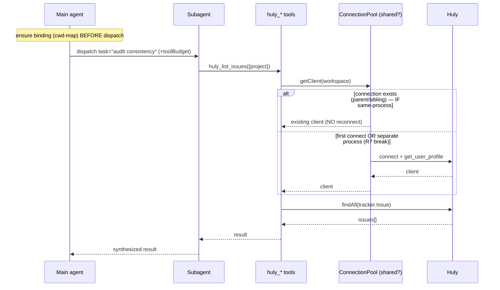

# UC-04: subagent dispatch (pi-subagents) — shared connection pool

> Bước 7/10. Main → dispatch subagent → dùng huly tools qua **shared pool** (D14).
> **Audited vs pi-subagents thật**: process model **UNVERIFIED** (R7) —
> "fresh/forked context" = conversation/git isolation, chưa confirm same-process.

## Overview

Main agent dispatch subagent (pi-subagents) cho research/audit/bulk (project-
design Bước 9). Subagent gọi huly tools → reuse connection pool (D14) → result.

## Actors & Systems

| Actor/System | Vai trò |
|---|---|
| Main agent (orchestrator) | dispatch subagent, ensure binding |
| Subagent (pi-subagents, fresh/forked context) | chạy task, gọi huly tools |
| huly tools | registered globally |
| ConnectionPool (module singleton) | shared — **CONTINGENT on same-process (R7)** |
| Huly | CRUD |

## Sequence (happy path, contingent R7)

## Error Path

- **Subagent KHÔNG resolve workspace** (no cwd-map, no param, subagent KHÔNG có
  UI để `/huly init`) → fail-fast `ConnectionError: no binding for cwd, run
  /huly init in main`. → Main phải bind TRƯỚC dispatch.
- **Connection drop mid-subagent** → pool reconnect (NFR-03), idempotent retry.
- **Subagent gọi delete** → `ctx.hasUI===false` (subagent headless) →
  confirmDestructive auto-deny (FR-09). Subagent KHÔNG delete (safety).
- **R7 break** (separate process): pool KHÔNG share → mỗi subagent connect riêng
  (auth overhead) → fallback per-subagent connect, hoặc main pre-connect + pass
  token via env (KHÔNG — violates no-env). Verify Bước 4.

## Notes (audit findings)

- **pi-subagents process model PARTIALLY VERIFIED (T-35, 2026-07-27)**: D14
  precondition verified in-process — `pool.ts` module singleton shares across
  logical callers (3 unit tests pass: main+subagent share 1 connection, concurrent
  no double-connect, cross-workspace boundary). **Dispatch runtime STILL
  UNVERIFIED** — audit T-35 xác nhận `pi-subagents` package KHÔNG trong
  peerDependencies, KHÔNG trong node_modules, pi-agent-core/coding-agent @0.82.1
  KHÔNG export dispatch API. Defer actual dispatch smoke tới T-36 e2e (khi
  pi-subagents available) HOẶC manual runtime verify.
- Lean hypothesis (GIỮ): subagent tool = in-process AgentSession → likely same
  process, D14 probably holds. T-35 verify precondition cho hypothesis này.
- **Binding precondition**: main ensure binding trước dispatch — subagent
  KHÔNG onboard (no UI). Orchestrator pattern.
- currentUser cache per-connection → shared IF same-process.
- Subagent read-heavy (research/audit) — write gated, delete blocked (headless).
