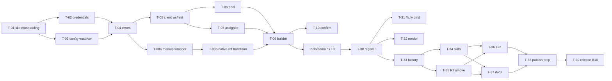

# pi-huly — Implementation Roadmap

> Bước 9/10. Module breakdown (KHÔNG phải feature). Size gate: L → split
> (issues 21 → 3 sub). T-XX = design ID. TaskStore = `local-tasks` (`TASKS.md`).
> Trace [04](./04-system.md) (modules), [08](./08-non-functional.md) (R1-R8).

## Task DAG

## Topology Order (thứ tự implement + duyệt)

| Order | Task | Size | Priority | Milestone | Blocked by | Blocks |
|---|---|---|---|---|---|---|
| 1 | T-01 skeleton + tooling (package.json, tsconfig, rolldown, oxlint/oxfmt, vitest, CI, .node-version=24) | M | high | M0 | — | T-02,03 |
| 2 | T-02 config/credentials.ts (auth union, workspace-required, id-handle, findByName) + unit | M | high | M0 | T-01 | T-04 |
| 3 | T-03 config/config.ts + resolver.ts (transport, projects cwd-map, longest-prefix, disambiguate) + unit | M | high | M0 | T-01 | T-04, T-31 |
| 4 | T-04 client/errors.ts (taxonomy, mapError, toToolResult) + unit | S | high | M1 | T-02,03 | T-05,09 |
| 5 | T-05 client/client.ts (connect ws/rest, generic CRUD, getCurrentUser) + integration mock | M | high | M1 | T-04 | T-06,07 |
| 6 | T-06 client/pool.ts (transport-aware, LRU, reconnect, closeAll, health) + integration | M | high | M1 | T-05 | T-09 |
| 7 | T-07 client/assignee.ts (resolveAssignee) + unit | S | medium | M1 | T-05 | T-09 |
| 8 | T-08a markup/markup.ts wrapper (text-markdown mdToMarkup/markupToMd) + unit | S | high | M1 | T-04 | T-08b |
| 9 | T-08b native-ref transform (reimplement) + round-trip fixtures (R8) | M | high | M1 | T-08a | T-09 |
| 10 | T-09 tools/builder.ts (defineHulyTool seam) + unit | M | high | M2 | T-06,07,08b | T-10, domains |
| 11 | T-10 tools/confirm.ts + unit | S | high | M2 | T-09 | domains |
| 12 | T-11 documents/teamspaces (10 tools) | M | high | M2 | T-09,10 | T-30 |
| 13 | T-12 snapshots (2) | S | medium | M2 | T-09 | T-30 |
| 14 | T-13 spaces (5) | S | medium | M2 | T-09 | T-30 |
| 15 | T-14 workspace/profile (5) | S | high | M2 | T-09 | T-30 |
| 16 | T-15 projects (6) | M | high | M2 | T-09 | T-30 |
| 17 | T-16 task-management (5, incl create_issue_status) | S | high | M2 | T-09 | T-19 |
| 18 | T-17 components (6) | S | medium | M2 | T-09 | T-30 |
| 19 | T-18 milestones (6) | S | high | M2 | T-09 | T-30 |
| 20 | T-19a issues-core (list/get/create/update/delete/move + add/remove_label = 8) | M | high | M2 | T-09,10,16 | T-30 |
| 21 | T-19b issues-templates (8) | M | medium | M2 | T-19a | T-30 |
| 22 | T-19c issues-relations+doclink (add/remove/list_relation + link/unlink_document = 5) | S | high | M2 | T-19a | T-30 |
| 23 | T-20 labels (4, GLOBAL) | S | medium | M2 | T-09 | T-30 |
| 24 | T-21 tags (7) | S | medium | M2 | T-09 | T-30 |
| 25 | T-22 tag-categories (4) | S | low | M2 | T-09 | T-30 |
| 26 | T-23 comments (4) | S | high | M2 | T-09 | T-30 |
| 27 | T-24 attachments (5) | S | medium | M2 | T-09 | T-30 |
| 28 | T-25 search fulltext (1) | S | medium | M2 | T-09 | T-30 |
| 29 | T-26 deletion preview (1) | S | medium | M2 | T-09 | T-30 |
| 30 | T-27 time log (1) | S | medium | M2 | T-09 | T-30 |
| 31 | T-28 todos (7) | S | medium | M2 | T-09 | T-30 |
| 32 | T-29 contacts read (2) | S | medium | M2 | T-09 | T-30 |
| 33 | T-30 tools/register.ts (register all domains) | S | high | M2 | T-11..29 | T-31,32,33 |
| 34 | T-31 commands/huly.ts (unified init/status/workspace/link/unlink) + unit | M | high | M3 | T-03,30 | T-33 |
| 35 | T-32 render/issue.ts + document.ts (3 tools) | M | medium | M3 | T-30 | T-33 |
| 36 | T-33 index.ts factory (register, session_shutdown→closeAll) | S | high | M3 | T-31,32 | T-34,35 |
| 37 | T-34 skills huly-docs/huly-tasks adapted (huly_ prefix, drop MCP refs) | M | high | M4 | T-33 | T-36 |
| 38 | T-35 R7 subagent smoke test | S | medium | M4 | T-33 | T-36 |
| 39 | T-36 e2e self-host smoke (~10 critical tools) | M | medium | M5 | T-34,35 | T-38 |
| 40 | T-37 docs (README, setup, /huly guide, Bước 10 deploy) | M | medium | M5 | T-33 | T-38 |
| 41 | T-38 npm publish prep (prepack, version, pi-package keyword) | S | high | M5 | T-36,37 | T-39 |
| 42 | T-39 release (Bước 10: strategy, tag, post-deploy monitor) | M | high | M5 | T-38 | — |

## Size gate

- **L**: KHÔNG có (issues 21 đã split → T-19a/b/c M/M/S). ✓
- **M**: agent đề xuất giữ nguyên (1 module homogeneous); user có thể yêu cầu
  split.
- **S**: implement trực tiếp.

## Milestones

| Milestone | Scope | DoD | Tasks |
|---|---|---|---|
| **M0 Foundation** | skeleton + tooling + config | build+lint+typecheck pass; config read/write; CI green | T-01,02,03 |
| **M1 Client core** | errors, client (ws/rest), pool, assignee, markup | mock Huly integration pass; markup round-trip fixtures green (R8) | T-04,05,06,07,08a,08b |
| **M2 Tools layer** | builder + 19 domains (~102 tools) + register | tất cả tool đăng ký; typebox schema valid; confirm gate; mock CRUD pass | T-09..30 |
| **M3 Commands + render + factory** | /huly unified, TUI render, factory | `/huly init` bind cwd; 3 tool render; session_shutdown cleanup | T-31,32,33 |
| **M4 Skills** | huly-docs/huly-tasks adapted | skill load, prefixed names, no MCP refs | T-34,35 |
| **M5 Hardening + release** | e2e, docs, publish, release | e2e self-host smoke; npm publish; Bước 10 release | T-36,37,38,39 |

## Definition of Done (milestone)

- Code: build + typecheck + lint + test pass (coverage ≥80% core).
- Docs: cập nhật; ADR audit pass.
- Integration: CI green; manual smoke (theo UC deep-dive).
- Risk register: R mới mitigation/accept.

## Risk carry-forward → tasks

- R2 (ws deps) → T-05/06 · R3 (rolldown externals) → T-01 · R4 (nub build) →
  T-01 · R6 (TS 7) → T-01 · R7 (subagent) → T-35 · R8 (markup) → T-08b · R1
  (license) → T-37/Bước 10.

## Priority distribution

- 🔴 high: T-01,02,03,04,05,06,08a,08b,09,10,11,14,15,16,18,19a,19c,23,30,31,33,34,38,39
- 🟡 medium: rest · 🟢 low: T-22

**Critical path**: T-01→02/03→04→05→06→09→(domains)→30→31→33→34→36→38→39.

---

_Exit criteria Bước 9: DAG + topology order + DoD từng milestone rõ ✓;
issues/milestones/labels tạo trong TaskStore (TASKS.md) sau Approval Gate._
